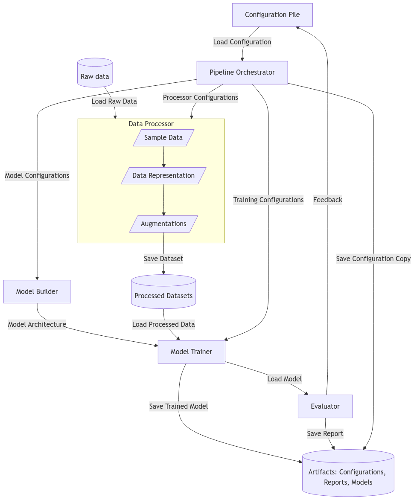

# Tetrahedron Pair ML Project

A flexible pipeline for optimizing model performance in tetrahedron-tetrahedron intersection and volume estimation. The architecture integrates data processing, model training, and evaluation, with tunable configurations for features, transformations, and dataset attributes.

## Architecture Overview

  
*Figure 1: Machine learning pipeline architecture. The pipeline orchestrator manages the workflow, handling configuration loading, data processing (sampling, transformations, augmentations), model building, and training. An artifacts manager handles saving and loading of configurations, trained models, and evaluation reports for reproducibility.*

### Key Components

- **Data Processing**:  

  Prepares raw tetrahedron pair data for training and validation with configurable steps:

    Data Loading & Sampling

        Loads raw geometric data (vertex coordinates, intersection volume labels).

        Samples datasets based on intersection type distributions (e.g., disjoint, fully intersecting).

        For polyhedron intersecting pairs, applies volume-aware uniform sampling to ensure balanced representation across volume ranges.

    Augmentations (Optional)

        Order invariance: Sorts tetrahedrons by coordinates or size to reduce input permutation sensitivity.

        Geometric transformations: Placeholder support for rigid/affine transformations, vertex permutations, and tetrahedron swaps (configurable but not yet implemented).

    Structured Saving

        Outputs processed data to standardized train/val folders for reproducibility.

- **Model Building**:  
  
- **Training & Evaluation**:  
  
- **Artifact Manager**

---

**Usage**: Clone the repo, adjust configurations in `config.yaml`, and run the pipeline to experiment with data or model settings.  
**Goal**: Optimize intersection detection and volume estimation accuracy through iterative tuning.