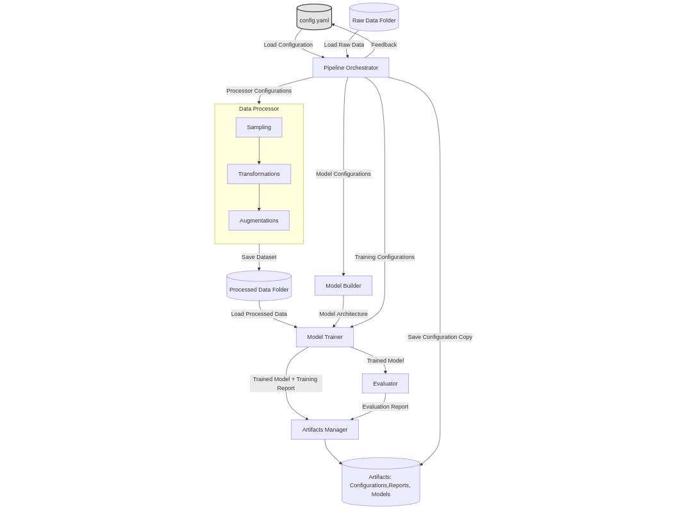

# Tetrahedron Pair ML Project

A flexible pipeline for optimizing model performance in tetrahedron-tetrahedron intersection and volume estimation. The architecture integrates data processing, model training, and evaluation, with tunable configurations for features, transformations, and dataset attributes.

## Architecture Overview

  
*Figure 1: Pipeline workflow. Processes include configuration setup, data sampling/transformation, model building, training, and evaluation. Artifacts (configurations, models, reports) are saved for reproducibility.*

### Key Components
- **Configuration Setup**:  
  Starts with a `Configuration File` to initialize parameters for data processing, model architecture, and training.

- **Data Processing**:  
  Raw data is sampled, transformed (e.g., Cartesian/Plücker coordinates, rotations), and augmented to generate processed datasets.

- **Model Building**:  
  Constructs neural networks based on configurable layers, activation functions, and architectures.

- **Training & Evaluation**:  
  Trains models on processed data, saves trained weights, and evaluates performance. Feedback loops allow adjustments to configurations.

### Artifacts
- Saved configurations, trained models, and evaluation reports.

---

**Usage**: Clone the repo, adjust configurations in `config.yaml`, and run the pipeline to experiment with data or model settings.  
**Goal**: Optimize intersection detection and volume estimation accuracy through iterative tuning.